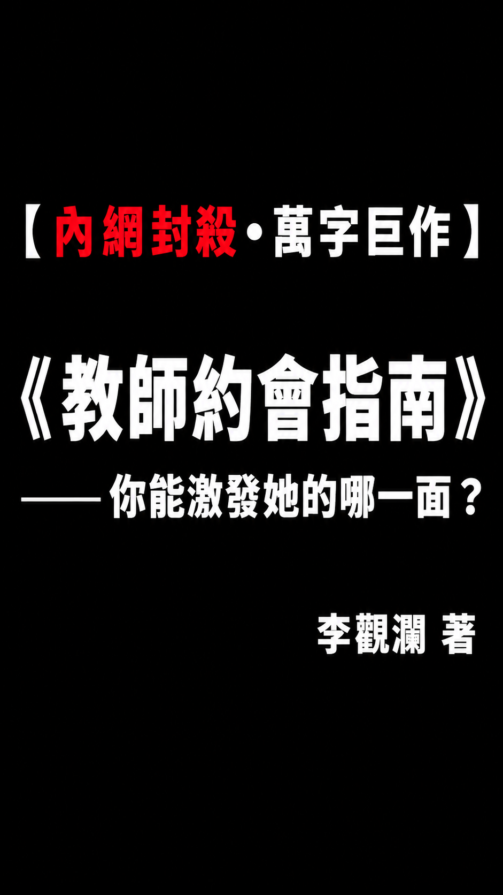
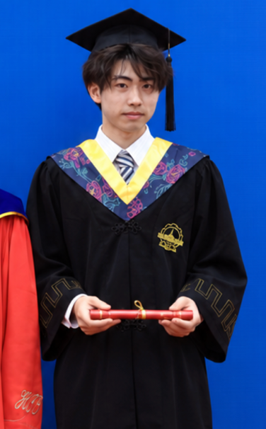

# 教师约会指南

[繁體中文](README.md) · [简体中文](README.zh-CN.md) · [English](README.en.md)

  

**你能激发她的哪一面**

李观澜

**2026年10月第一版**

中国｜哈尔滨｜黄河路

不设版权，随意转发

> 「仅以此书献给我的父亲——那个软弱无力、与我母亲生下我后又家暴离婚的低级『黄毛』。他拿着女方的钱和补偿扬长而去，从未付过一分抚养费。他是我永远的负面榜样。

> 成为黄毛的猎物，是一生的痛；

> 但进化成掠夺一切的黄毛，是一生之爽。」

## 作者简介

李观澜，男，2004年生于河南省南阳市。结业于哈尔滨工业大学。曾就职于工地、奶茶店、健身房销售、国家机器人研究中心，国家精密仪器研究所。现为数字游民。

李观澜先生从2022年开始专心研究泡妞事业，技能条阴差阳错点到了情感行业，受野学影响，不忍汉男被薄肌女本位思想毒害，为汉男思想觉醒上一把火，这是他的处女作。

  

## 目录

- [第一章 前言](#chapter-1)
- [第二章 老师这层身分，到底意味着什么](#chapter-2)
    - [2.1 中国不同阶层女性筛选依据](#section-2-1)
    - [2.2 慕强：先把“强”说清楚](#section-2-2)
    - [2.3与大学老师，别把约会当成考试](#section-2-3)
    - [2.4 与中学教师相处](#section-2-4)
    - [2.5 和幼师相处](#section-2-5)
- [第三章 让她先看见你](#chapter-3)
    - [3.1 自媒体增加曝光](#section-3-1)
    - [3.2 孔雀开屏仍然非常适用](#section-3-2)
    - [3.3 兴趣要表达，生活要有内容](#section-3-3)
- [第四章 汉男缺少的这门性课](#chapter-4)
    - [4.1 操爽她，让你成为必须](#section-4-1)
    - [4.2 幻想、角色与现实愿望](#section-4-2)
    - [4.3 为SM正言：痛与快感之间发生了什么](#section-4-3)
    - [4.4 为“捆绑”正言](#section-4-4)
    - [4.5 私密空间，环境影响继续](#section-4-5)
- [第五章 长期关系？长期炮友？](#chapter-5)
    - [5.1 两个人，都要有说话的分量](#section-5-1)
    - [5.2 心情不好，再来一炮](#section-5-2)
        - [5.2.1 脾气暴的，是没被操爽过](#section-5-2-1)
    - [5.3 探索新鲜事物](#section-5-3)
        - [5.3.1 户外与禁忌幻想](#section-5-3-1)
        - [5.3.2 角色扮演](#section-5-3-2)
        - [5.3.3 旅游与爱好](#section-5-3-3)
        - [5.3.4 共同事业](#section-5-3-4)
- [第六章 超越老师](#chapter-6)
    - [6.1 祛魅公务员、教师，尤其是大陆看似体面的工作](#section-6-1)
        - [6.1.1 北理工裴轶的女权课](#section-6-1-1)
        - [6.1.2 水硕、博士、头衔：这条路换来了什么](#section-6-1-2)
        - [6.1.3 博士推荐制度](#section-6-1-3)
        - [6.1.4 朱跃军的启示](#section-6-1-4)
        - [6.1.5 学阀、靠山与舆论高地](#section-6-1-5)
    - [6.2 回归自己](#section-6-2)
    - [6.3 拥抱SI](#section-6-3)
- [结语](#chapter-7)
- [致谢](#chapter-8)
- [参考文献](#chapter-9)

## 第一章 前言

我写这本书，不想让汉男再把约会过成资格审查。搭讪、炸街、展示面的影片一大堆，理论也背了不少，人真坐到面前，却只剩报学历、报收入、证明自己值得被喜欢。你是来认识她，还是来求她批准？能吸引注意，下一步怎么相处，这段路得讲清楚。

我从2022年开始研究泡妞。读书时看实战视频，觉得比一堆空讲的理论有意思；后来自己做内容，也接触到不同学历和职业的女生。这本书从这些观察出发。它要讲的是：你怎么判断一个人，怎么呈现自己，怎么认识身体体验，怎么让关系继续有内容。读者只看目录，也该知道每节究竟在争论什么。

拿老师说事，就是要拆掉那层把男人吓住的光环。学历、体面、稳定，还没见人，你先替她加满分。我要问的是：她的时间谁说了算，收入和家庭给她多少余地，跟你在一起又能有什么内容。她在教室里是老师，离开教室怎么生活，这才是你要认识的人。

人是动物。学历、职称、为人师表，都不会让欲望消失。她在工作里能克制，换个处境会怎样，就得放回那个处境里看。德国205人连续七天记录了7,827次各种日常欲望：人格较多关联有多想要、会不会冲突，情境较多关联抵抗与实际行动。[\[1\]](#ref-1)想要、遇到机会、真正去做，是不同的事。看懂一个人，要把这几件事连起来。

## 第二章 老师这层身分，到底意味着什么

老师这个身份，做题认知高些，对社会认知普遍低，对理财更是。比精神小妹可以聊哲学，不过没精神小妹痛快利索。比精神小妹装一些， 拿下的话，页需要装一些。

### 2.1 中国不同阶层女性筛选依据

别扯什么感觉，筛选的底层逻辑就是三件事：她手里有什么资源，她的时间谁说了算，她做选择付什么代价。你得一眼看穿她缺的是钱、是时间、还是被征服的体验，别他妈乱给。

高阶主管：人家有钱有权，你凑上去还跟个弟弟一样等安排？她的时间按分钟算，你如果不能把地点、行程安排得明明白白，让她脑子彻底放空，她凭什么拿时间陪你耗？

独立创作者：靠接案活着，时间跟着项目走。别傻逼一样只会夸「你好有才华」或者问「你一个月赚多少」。看懂她把命砸在哪个项目上，比你查她户口有用一百倍。

地方资源型二代（婆罗门）：家里房本一堆、熟人遍地。这类女人早就不缺吃喝了，你请她去米其林餐厅装逼，她心里只会冷笑。你得拿得出她那个圈子里见不到的野性、见识和生活方式，才能砸开她的防御。

传统家族成员：这类人背后牵扯着一大家子。你跟她约会，背后是她家族的算盘。要是你一上来就惦记她家能给你什么资源，最后绝对被算计得骨头都不剩。

新蓝领经营者：开店做生意的，时间就是真金白银。你周末放假想黏着她，她周末正忙着赚钱。如果作息接不上，你所谓的「陪伴」就是耽误人家赚钱，这种关系撑不过三个月。

### 2.2 慕强：先把“强”说清楚

女人慕强是天性，但你得搞清楚到底什么是「强」。有钱有资源是强，遇事能扛事是强，在床上能让她下不来床也是强。很多汉男把「强」全等同于「老子有钱」，最后只会抱怨「我都这么有钱了她为什么不爱我」。

别听那些心灵鸡汤，跨国大调查涵盖45个国家、上万人的数据明明白白写着，女性就是比男性更看重经济前景[\[2\]](#ref-2)。钱是你的底气，是你的护城河，但你得把这份底气变成相处时的带领感，而不是每天像个暴发户一样报存款余额。

真正的带领，是遇事能拍板。实验数据早就证明了，女人骨子里迷恋的是那种受人尊重的威望型男人，而不是只会无能狂怒、靠打压别人来找存在感的傻逼[\[3\]](#ref-3)。你能把事情办成，她自然服你。

### 2.3与大学老师，别把约会当成考试

跟大学教师约会，别坐下来就答辩。她懂自己的课题，你也懂自己的工作；不熟就听她讲，没必要临时背术语。你急着报学历、报收入、讲前途，整场约会就变成她问你答。原本能聊两个人的生活，结果只剩你在解释自己配得上。大学教师有没有空，看这学期的课、学生、研究计划和聘任要求。寒暑假少上课，研究还得做，计划还得交。先问她最近忙什么，再约能见面的时间。真要长期交往，工作能不能调动、两个人住哪里，再摊开讲。你听到「稳定」就把日子想好了，稳定的可能只有她那份工作。

约会选你也想做的事。你想看的展、想去的地方、正在做的计划，都能拿出来聊。你熟悉其中的东西，才有自己的看法，也能接住她的反应。连自己都不喜欢的活动，为了让她高兴还得硬演，图什么？如果没意思，你自己的时间不也被浪费？

### 2.4 与中学教师相处

中学教师，先看具体工作。班导师、科任教师、带早晚自习的人，空下来的时间差不少。值班、考试、家长沟通，哪件事卡住了，就先把日程弄清。约会撞上她最忙的时候，安排再多也坐不安稳。知道她哪天能停下来，比一天到晚猜她为什么没回消息有用。上海初中老师那份TALIS 2024调查，把压力列得很清楚：48%的受访者说，对学生成绩负责带来较大或很大压力；37%提到对学生社会与情绪福祉的责任。[\[5\]](#ref-5)成绩要管，学生状态要管，家长还会找上门。约会得找她能放下工作的时间，否则人来了，脑子还留在班里。

大男子主义一点！人骨子里都是不想做决定的，她们更倾向于做选择，甚至被安排。 她已经带了一天学生，见面还要她选地点、查路线、决定吃什么？这些事你直接给出答案，约会就轻松不少。时间说清楚，地方找好，记住她说过的口味，临时有变动也有办法。男人的办事能力就在这些小事里，没必要每次安排完还讨好地问一句「我是不是很会照顾你」。

### 2.5 和幼师相处

她工作里越是温柔、越是压抑，私底下就越渴望狂野和释放。给她一个不用做决定、不用照顾任何人的环境，把她那层圣母的壳砸碎，看看里面到底藏着什么样的欲望。幼师白天对着几十个小孩赔笑脸，下班了你还让她围着你转？有的男的一听幼师，心里盘算的是「以后生了孩子自带免费保母」。你算盘打得这么响，人家凭什么扶贫？

说白了，其实不分身分，对于大学、中学、小学老师，或者说在中国这种高度压抑的环境下，多数女性骨子里都渴望你主动，都渴望你带给她狂野的释放。张弛有度，在私密空间展现你的强势与狂野，在生活细节上展现你的办事能力，这种极致的反差张力，一瞬间就能把她拉满。

## 第三章 让她先看见你

女老师每天在学校见多少人？几十个家长、上百个学生、一堆穿着灰黑Polo衫的无趣男同事。她一整天都被裹在一个极度枯燥、刻板的环境里。你想把她泡到手，第一步绝对不是上去嘘寒问暖，而是**像一道闪电一样劈开她那个死气沉沉的世界**。

你得让她先看见你，而且是看见一个极具攻击性、完全不受她那套体制规则约束的野男人。

### 3.1 自媒体增加曝光

我早就说过，抖音、小红书对汉男来说，根本不是什么娱乐平台，那是你他妈的**专属筛选器和猎场**！

我读书的时候随手搞出几个爆款影片，结果呢？私信直接炸了。从本科生到女博士，从公务员到女老师，全都有。为什么？因为在她们开口跟你说第一句话之前，你的生活方式、你的野心、你对这个操蛋世界的看法，就已经把她们洗过一遍脑了。这叫降维打击！

「Fake it，then be it」。这不是教你当骗子，而是教你把男人的框架先立起来。拍摄角度可以找，表达可以练，但你必须把你的「狠劲」和「价值」秀出来。

记住，别像个土鳖一样只会发方向盘和手表，那种低级炫富只会招来捞女，在女老师眼里更是空洞得可笑。她们在学校里见惯了表面文章，她们心底里真正慕的是**智力、见识和手腕**。你懂技术，就把你熬夜写代码、搞硬体专案的狠劲发出来；你懂玩，就把你在雪场、在野外的狂野发出来。你要让她隔着荧幕都能感觉到：**这个男人的生活，是我这辈子在办公室里绝对触碰不到的。**

### 3.2 孔雀开屏仍然非常适用

男人就是得开屏，别装什么低调！低调是给死人准备的。

打个耳钉、做个发型、穿有设计感的衣服、甚至收拾得像个斯文败类，有什么好怕的？女人骨子里全是他妈的视觉动物！女老师白天看了一天那些油腻、秃顶、唯唯诺诺的男同事，你晚上西装革履或者一身潮牌地出现在她面前，带着点渣男的痞气，她的眼睛绝对会死死黏在你身上。这叫撕裂她的日常审美。

但开屏不是让你当个没有灵魂的小丑。当你的外表把她的注意力死死勾住时，你肚子里得有真家伙。她问你衣服的品味、问你的爱好，你得能扯出一套逻辑严密、带着你个人强烈色彩的故事。外在的刺用来破防，内在的逻辑用来控场，这才是孔雀开屏的必杀技。

### 3.3 兴趣要表达，生活要有内容

看上了就直接上，把你的欲望明明白白地写在脸上！

觉得她有气质，想睡她，想跟她发生点什么，就直接把「我想认识你」这几个字砸过去。别他妈藏在「李老师，我想请教您一个专业问题」这种傻逼借口后面。你猥琐地试探半天，人家还真以为你是一个热爱学习的好青年，直接把你当学生处理了。你连自己是个有性欲的男人都不敢承认，还指望女人高看你一眼？

见面了，聊什么？聊你周末去哪野了，聊你最近在搞什么项目，聊你对某件事一针见血的暴论。**绝对不要问「今天上课累不累」、「学生听不听话」这种太监问题！** 你的任务是把她从「老师」这个压抑的角色里狠狠拽出来，拽进你的世界，而不是跑去她的世界里当个居委会大妈。

最后，用行动测试她的服从度。你抛出话题，看她接不接；你约她出来，看她愿不愿意配合。如果她真忙，她会主动给你另一个时间；如果她只会给你几句客气的废话，让你像个舔狗一样猜上一个星期，**直接让她滚蛋**。

你的时间，只留给愿意进入你框架的女人；你的生活内容，只分享给那些配得上你价值的猎物。

## 第四章 汉男缺少的这门性课

这堂课，是汉男最该补、却最不敢面对的一堂课。

你履历写得再漂亮，收入再高，那叫「供养价值」，那只能让她觉得你「适合结婚」。但她愿不愿意死心塌地、像上瘾一样一次次主动回来找你？全看你在床上能不能把她彻底征服。汉男最大的悲哀，就是花光了所有精力去证明自己是个好人，到了亲密相处时，却像个三秒钟的废物，自己爽完倒头就睡，把女人当泄欲工具，最后还纳闷她为什么对你冷淡。

### 4.1 操爽她，让你成为必须

身体条件你必须正视，这没什么好自卑的。我181厘米，遇到175厘米、有健身习惯的成年女生，体力上我都得拼一把。体力不够怎么办？用技术补，用玩具补！辅助用品不是来嘲笑你无能的，那是你手里的武器。你要给她的，是一场让她大脑空白的体验，而不是一场三分钟的早操。

科学家让上百对情侣连续记了21天的私密日记，结论非常残酷：在床上只顾自己爽的，最后关系全得崩盘[\[6\]](#ref-6)。你要把她操爽，就得把自己的傲慢收起来，去感知她身体的反馈。

事后别他妈问那句傻逼一样的「满意吗？」——这等于逼她照顾你的面子。你要问就问到刀刃上：「刚才那个姿势你哪里最爽？」、「哪里还觉得不够？」只有把这些话扒开了说，你才能精准地掌握她的开关。性是真刀真枪的博弈，不是你单方面的拙劣表演。

### 4.2 幻想、角色与现实愿望

女人脑子里想的东西，比你野得多！尤其是那些高学历、有编制的女老师。

加拿大搞了上千人的调查，数据直接打脸那些满嘴仁义道德的婊子：超过64%的女人幻想过被绝对支配，超过一半的人幻想过被绑起来[\[7\]](#ref-7)！美国大学生的数据也一样，62%的女生脑子里有过强迫性幻想的念头[\[8\]](#ref-8)。

为什么？因为她们白天装高雅、装体面装得太累了！一个女老师，白天站在讲台上管着几十个学生，每一句话都要符合「师德」，每一个动作都要端着。她越是地位高、平时越是发号施令，私底下就越渴望被一个强势的男人粗暴地按在墙上，彻底卸下做决定的责任。这就是人性最真实的反差。

### 4.3 为SM正言：痛与快感之间发生了什么

别一听到SM就觉得是心理变态，觉得那是下三滥才玩的东西。睁大眼睛看看荷兰的数据：玩BDSM的人，主观幸福感比普通人还高，而且这帮人里，高学历的比例高达70%[\[9\]](#ref-9)！

根据比利时的研究：当她在你手里扮演服从者的时候，她身体里的压力系统和奖赏系统是同时飙升的[\[10\]](#ref-10)。痛感、屈辱感、期待感混在一起，大脑直接高潮。

我再强调一遍这条底层逻辑：学历越高、平时越端着的女老师，骨子里的探索欲和对禁忌的渴望就越强[\[12\]](#ref-12)。她白天是受人尊敬的老师，晚上就是你手里的玩物。不要用你那点可怜的道德观去绑架她，给她一个安全的情境，让她体验那种被撕裂尊严的极致快乐。

### 4.4 为“捆绑”正言

很多人以为捆绑就是绳子，错了！捆绑的核心，是「权力的彻底交接」。

她白天要管学生、要应付家长、要写报告，每一分钟大脑都在高速运转，都在做决定。当你把她绑起来的那一刻，她就失去了所有行动力，她不需要再做任何决定了。

对21名BDSM实践者的深度访谈早就揭示了这个秘密：她们迷恋的，正是那种「把控制权彻底交给信任的男人」的释放感[\[13\]](#ref-13)。实地测试的数据也证明，玩完这套，压力指标直接暴跌，两人的亲近感飙升[\[14\]](#ref-14)。

别跟我扯什么女权和尊重。还是那句话：爱你的人会为你穿上黑丝的。认可你性价值的女生会含住你的，超级无敌爱你的，会吞下XX的。 这就是女人最真实的慕强，她只会臣服于能彻底驾驭她的男人。

### 4.5 私密空间，环境影响继续

女老师最怕什么？最怕熟人的眼光，最怕被学生家长撞见。在外面，她必须死死披着那层「为人师表」的皮。

所以，你准备的私密空间，必须绝对安全！把房间收拾干净，床品搞舒服，灯光调暗，放点能让人神经放松的音乐。投影、绿植都可以有，但最关键的是：你要让她觉得，在这个房间里，她不再是老师，她只是一只发情的母兽。

人在安静、私密、没有审判的空间里，动物性就会彻底爆发。别按部就班地走什么流程，跟着直觉走，她有一点放松和渴望的信号，你就毫不犹豫地像狼一样咬上去。环境给了她卸下防备的借口，而你要做的，就是把这个借口变成现实。

## 第五章 长期关系？长期炮友？

追到手以后怎么办？如果你们的相处只剩下吃饭、看电影、回复那种毫无营养的早安晚安，约会迟早会变成打卡。她对你的欲望会被日常的琐碎彻底磨灭。

长期关系想要不枯燥，必须有继续生长的东西：权力上你能压得住她，身体上她离不开你，生活里你们还有足够野的共同经历。否则，你不过就是她漫长人生里一个无聊的供养者，或者一个随时可以换掉的长期炮友。

### 5.1 两个人，都要有说话的分量

你在这段关系里，必须有绝对的说话分量！

我说的地位平等，不是工资卡交上去，也不是家务活一人一半，而是遇到分歧时，谁能拍板，谁能承担后果！你为了她的一句「工作稳定」，就放弃自己的事业跑到她的城市；你为了讨好她，把家里的活全包了，连晚上吃什么都要等她批准。这不叫爱，这叫你把主动权双手奉上。你一直退让，最后连呼吸都要看她脸色。

她的编制在本地，你的机会在外地，凭什么就得是你牺牲？教师的工作是稳定，但如果你留下来的代价是变成一个没有事业的废物，她以后只会打心眼里鄙视你！

话语权是靠办成事情砸出来的！住哪、钱怎么花、遇到麻烦怎么解决，你得有拿主意并扛下结果的能力。光会喊「我要说了算」，却处理不了一点烂摊子，谁他妈服你？你能把事办漂亮，你的态度才有分量。

### 5.2 心情不好，再来一炮

长期关系里，最愚蠢的行为就是跟女人讲道理。

她下班回来抱怨学校领导傻逼、家长难搞，你立马坐直了身子给她分析局势、教她怎么做人？你这不纯纯的傻逼吗！她白天在学校听领导训话，晚上回来还得听你上政治课？爹味太重，只会让她觉得你面目可憎。

记住这条铁律：女人情绪上来了，先处理情绪！ 百分之96的女人，你只要在她情绪崩溃的时候，用强势的态度抱住她，在床上狠狠操服她，当个XX一样哄哄她，什么事都没了！等她爽完了、冷静下来了，你再跟她谈怎么解决事。

Birnbaum那帮心理学家的伴侣研究早就把这点说透了：让她感觉到你懂她、你在乎她，她的性欲会直线飙升[\[15\]](#ref-15)。听得进去她的情绪，转手在床上狠狠释放，这才是最高级的琴瑟和鸣。相处要是只剩家务和讲道理，吸引力连个屁都不剩。

#### 5.2.1 脾气暴的，是没被操爽过

下面这几段，是老子结合亲身经历、多次深度访谈得出的暴论。你不服也得憋着！

那些脾气爆炸、天天无能狂怒的女老师，根本原因只有一个：生活中缺乏高质量的性体验，没有得到过真正的异性待遇！

她生活得苦，欲望极度压抑，只能靠打骂学生、对身边人发飙来输出情绪。为什么？因为她老公在床上是个废物！给不了她半点满足感，她心里扭曲，自然就痛苦。

这种女人，骨子里极度渴望一个强力的男人，一个能在生活和肉体上给她绝对指引的王！她根本不想天天硬撑着当什么女强人，她需要一个心灵寄托。只要你够狠、够强，把她彻底操爽，让她知道头顶上有个男人能绝对压制她，她立马就服你，变成一只温顺的猫。

甚至我敢说，很多所谓的女同，也是因为从来没被真正有力量的男人操爽过，从来没感受过什么叫真正的性爱！

### 5.3 探索新鲜事物

新鲜感不是换个姿势，而是带她进入未知的禁区。

老美的数据血淋淋地摆在那：调查了四千多个已婚人士，结果发现，学历越高的人，出轨和玩花样的比例反而越高[\[17\]](#ref-17)！多读了几年书、当了个体面老师，绝对不会让她的欲望消失，只会让她更懂得隐藏和寻求刺激。

你不带她去探索新奇的东西，相处只剩下消耗，她迟早会去找别人探索[\[19\]](#ref-19)。你想不想、值不值、敢不敢，直接决定了你们关系的保鲜期。

#### 5.3.1 户外与禁忌幻想

户外露出、野外激战，追求的就是场景反差和极限刺激。

她白天是讲台上端庄的老师，晚上你把她带到私人营地、露台或者野外车里。在随时可能被人撞见的恐惧和兴奋中，她那层虚伪的体面会被撕得粉碎。

但玩这些之前，你必须把她这个人吃透！如果你看不透她，那就上手段：把你们的对话偷偷录音，扔给AI！ 在玩真心话的时候，问她10个直击灵魂的问题：挖她的原生家庭，挖她对极端事情的看法。不要浅浅地问，要死死追问「为什么」，问她「如果XX，你会怎么办」。

你看不出来没关系，把这些语音转文字扔给GPT，让AI从哲学、心理学、经济学的角度，把这个女人拆解得连底裤都不剩！老子就是这么对自己进行覆盘拆解的。摸透了她的底层防御，你才知道该用什么场景让她彻底沦陷。

#### 5.3.2 角色扮演

她上班要扛起老师的架子，下班了你得帮她把这层皮剥下来。

买几套衣服，换个称呼。让她演女仆、演护士、或者演被你惩罚的学生。这不仅仅是为了刺激，这是为了让她合法地脱离日常的身分枷锁。两个人都投入进去，每次玩完覆盘一下哪里最爽，把她骨子里的骚劲一点点挖出来。

#### 5.3.3 旅游与爱好

别每天只会换不同的网红餐厅吃饭，那叫低级消费。去骑马、射箭、潜水、搞摄影。Aron的心理学实验早就证明了：情侣一起去完成那种心跳加速、新奇刺激的任务，关系质量会瞬间暴增[\[20\]](#ref-20)。一起去面对未知，一起出汗，你在这过程中展现出来的解决问题的能力，比你说一万句情话都管用。长期爱好能让你们的关系一直长出新东西，这才是真正的后劲。

#### 5.3.4 共同事业

如果有共同事业，这会把你们的关系直接推进到另一个维度。这叫利益绑定。

Rusbult的投资模型：时间、钱、项目投进去了，退出的成本就变得极高[\[21\]](#ref-21)。她舍不得离开你，不仅是因为喜欢你，更是因为离开你会让她损失惨重！

但记住最核心的一点：你必须占据绝对的主导地位！ 哪怕股权你俩六四开，哪怕在她擅长的领域你可以适当放权，但总体的盘子必须由你来控！开始前，谁出资、谁干活、资产归谁、散伙了怎么分，白纸黑字写得清清楚楚。

不要以为和老婆创业就比自己创业轻松，丑话说在前头，把利益算明白了，你们在床上才能干得更纯粹。

## 第六章 超越老师

### 6.1 祛魅公务员、教师，尤其是大陆看似体面的工作

中国人对体制内、高校的光环滤镜实在太重了，这就是一种病态的社会崇拜。那个部分领域和你有什么关系呢？和你们在经营一段两性关系有什么关系？你在你的行业里也是个专业狠角色，凭什么要在他们面前自降身价？

很多拿着死工资、自以为体面的人，不过是活在一种虚假的优越感里。尤其是那一堆当官的、所谓的高校学者，学历多数全他妈是水出来的，真才实学懂个JB？除非她手里握着能跟你进行硬核资源互换的实权，否则那点「体面」一文不值。

别忽略人就是动物的本质，不要刻意去美化这帮人。人类有自己的欲望，白天越是道貌岸然、被体制和规矩压抑得越狠，私底下欲望的反弹就越极端。玩反差、玩换妻、搞3P等极限游戏的，往往就是这群看似最体面的人！每个人都有欲望的边界，不要以为穿上正装他们就没了兽性。科学数据早就证明了：高学历的人，往往更容易出轨，也更愿意玩SM。为什么？因为他们智商高、对平庸的日常更容易感到无聊，骨子里探索新鲜事物和禁忌的欲望比普通人强烈得多。

在体制内装孙子装久了，权力就成了他们最好的春药。白天在讲台上、在机关里满嘴仁义道德，晚上到了私密圈子里，他们比谁都玩得花。换妻、3P、把别人的尊严踩在脚下，这是他们用来发泄体制压抑、确认自身『特权』的唯一方式。你看透了这层虚伪，就能拿捏她们的软肋。

#### 6.1.1 北理工裴轶的女权课

北理工的裴轶，在学校里开着《数字时代的女性权益保护》的女权课，表面上是个为女性发声的高尚学者。结果私下群组里大搞「巧克力属性」，在外网社群里直接说「我支持男的低人一等」。受到的毒打太少了，日子过太顺了，就是这种人爬上来太容易了，才这么口无遮拦。

这件事在YouTube、夸克说等不受国内媒体过滤的地方早就被扒得底朝天。虽然最后北理工迫于压力取消了她的教师资格并解聘，但这事根本没凉透！网友顺藤摸瓜扒出，厚大法考那个叫「刘伟」的讲师，其实就是她老公郝冠揆。老婆在高校里打着女权旗号洗脑学生，老公一边当着警察老师，一边在外面化名开补习班，疯狂捞了几百万！

这就是这帮人的真面目：满嘴的主义，背地里全是他妈的生意。如果舆论高地，男性不占领，就会被这种无知的思想占领！汉男不能只在私底下骂，必须把这帮人砸下神坛。

#### 6.1.2 水硕、博士、头衔：这条路换来了什么

别被那一串「英国硕士」、「高校博士」的名头唬住，很多人的学历就是一条赤裸裸的洗白产业链。

现在中国学术圈有一大帮人，普通二本毕业，家里砸点钱送去英国水个一年制硕士，回国后靠着关系在中国申请个博士，摇身一变就成了一堆头衔的「高校专家」。每走一步，他真的多长了本事吗？没有！这叫学历的「滚筒洗衣机」。履历上只写去哪里读过书，但谁付的成本、谁帮他打通的入口、论文是谁代笔的，全都不写。名校先给一份信用，他们拿着这份信用去换资源，这就是一个巨大的骗局。

#### 6.1.3 博士推荐制度

你以为考博士是凭真才实学？错了，那是一个彻头彻尾的黑箱。

高校博士招生的规则写得明明白白，要专家推荐，要「申请—考核制」。说白了，作品交给谁看、谁愿意让你进门，全靠背后的利益交换。导师个人权力过大，监督规定形同虚设。你没有靠山，不会敬酒，不懂拜码头，你的材料连上桌的资格都没有。这不是什么神圣的学术殿堂，这就是权力寻租的角斗场。门票从来不是白白掉到手里的。

#### 6.1.4 朱跃军的启示

再看看真正有本事、没背景的人在学术圈是什么下场！

上海交大的朱跃军，1991年《Blood》期刊上那篇轰动一时的白血病基因重组论文，他是第二作者，是真正干活出成果的人！冷泉港现在还留着他1993年写给科学大佬的信。结果呢？就因为跟导师有学术分歧，被学术圈的学阀彻底封杀，博士学位不给，工作处处碰壁，一个顶尖的科研人才，最后只能滚回乡下行医，靠吃低保度日！

学阀抢了你的成果，踩着你的尸骨功成名就，还要砸碎你的饭碗。这就是真实发生的事！当你看到那些光鲜亮丽的「学术权威」时，别忘了，他们脚下踩着无数个朱跃军。了解了这套吃人的规则，你还会觉得她们的圈子有多高尚吗？

#### 6.1.5 学阀、靠山与舆论高地

体制内和学术圈就分两种人：靠关系进来的「婆罗门」，和没有根基的「小镇做题家」。

婆罗门只要靠山不倒，就能呼风唤雨。学阀掌控了一切：什么算好研究由他说，名额、经费、职位全由他分配。学生跟他争一个问题，连自己的去留都可能搭进去。这是一个高度封闭、利益板结的圈层。不要妄自菲薄，也不要轻易自大，祛魅不是让你无脑蔑视，而是让你把这些光环扒掉，把他们还原成一个个受利益和欲望驱使的具体的人。看透了这套玩法，你才不会被她们虚假的头衔PUA。

### 6.2 回归自己

别把泡妞当成你人生的KPI。

你拼命挣钱、疯狂健身、读书旅行，如果做这一切的终极目的只是为了问一句「她会不会喜欢」，那你这辈子就是个等着女人验收的奴才。

回到你自己！你有你的事业，你的爱好，你的兄弟。喜欢一个女人可以投入，但绝对不能把人生的方向盘交给她。她今天不回你消息，你照样赚钱；这段关系黄了，你的帝国照样运转。敢于随时掀桌子走人的男人，才不会在关系里被榨干。

### 6.3 拥抱SI

我说的SI（超级智慧），就是用AI武装你的大脑，把两性博弈变成一场数据战。

别靠你那点破记忆力。见面当时觉得挺爽，吵架了就觉得「这女人有病」，这叫情绪化，这叫无能！把实际发生的对话、事情的转折点记录下来（语音也好，文字也罢），直接扔给GPT或Claude。

让AI帮你找规律：她一碰到什么话题就破防？她最容易在什么场景下服软？你用工具剔除掉自己的感性滤镜，把她当成一个项目去拆解。下一次交手，你就能精准打击她的七寸。不靠猜，靠数据，理解才能转化为你手里的权力。

## 结语

你会发现，我本来想写教师约会指南，其实每个人都有很多身份。女人也是人，人有多面性。和龟男在一块表现出来的是传统中国女性，和冒险大胆的男生激发表现出来的是，勇敢探索，无视世俗定义。婊子圣母的一面人人都有，无论男女，只不过有人能顺应调节。换到男生视角，她像个盲盒，你能激发哪种品质，取决于你，主体性也在你。这是一场修行，道阻且长。

## 致谢

感谢李新野先生的启迪，晚辈做此书。感谢搭讪玩家Mikey，梵公子在公网输出干货，共同学习。

## 参考文献

\[1\] Wilhelm Hofmann, Roy F. Baumeister, Georg Förster, Kathleen D. Vohs. (2012). Everyday Temptations: An Experience Sampling Study of Desire, Conflict, and Self-Control. Journal of Personality and Social Psychology, 102(6), 1318–1335. <https://doi.org/10.1037/a0026545>

\[2\] Kathryn V. Walter, Daniel Conroy-Beam, David M. Buss, et al. (2020). Sex Differences in Mate Preferences Across 45 Countries: A Large-Scale Replication. Psychological Science, 31(4), 408–423. <https://doi.org/10.1177/0956797620904154>

\[3\] Jeffrey K. Snyder, Lee A. Kirkpatrick, H. Clark Barrett. (2008). The Dominance Dilemma: Do Women Really Prefer Dominant Mates? Personal Relationships, 15(4), 425–444. <https://doi.org/10.1111/j.1475-6811.2008.00208.x>

\[4\] Paul W. Eastwick, Eli J. Finkel. (2008). Sex Differences in Mate Preferences Revisited: Do People Know What They Initially Desire in a Romantic Partner? Journal of Personality and Social Psychology, 94(2), 245–264. <https://doi.org/10.1037/0022-3514.94.2.245>

\[5\] OECD. (2025). Results from TALIS 2024 – Country Notes: Shanghai (China). OECD Publishing, 13页. <https://www.oecd.org/en/publications/results-from-talis-2024-country-notes_e127f9e2-en/shanghai-china_52daa5ab-en.html>

\[6\] Emily A. Impett, Amy Muise, Cheryl Harasymchuk. (2019). Giving in the Bedroom: The Costs and Benefits of Responding to a Partner’s Sexual Needs in Daily Life. Journal of Social and Personal Relationships, 36(8), 2455–2473. <https://doi.org/10.1177/0265407518787349>

\[7\] Christian C. Joyal, Amélie Cossette, Vanessa Lapierre. (2015). What Exactly Is an Unusual Sexual Fantasy? The Journal of Sexual Medicine, 12(2), 328–340. <https://doi.org/10.1111/jsm.12734>

\[8\] Jenny Bivona, Joseph Critelli. (2009). The Nature of Women's Rape Fantasies: An Analysis of Prevalence, Frequency, and Contents. The Journal of Sex Research, 46(1), 33–45. <https://doi.org/10.1080/00224490802624406>

\[9\] Andreas A. J. Wismeijer, Marcel A. L. M. van Assen. (2013). Psychological Characteristics of BDSM Practitioners. The Journal of Sexual Medicine, 10(8), 1943–1952. <https://doi.org/10.1111/jsm.12192>

\[10\] Elise Wuyts, Nele De Neef, Violette Coppens, Erik Fransen, Eline Schellens, Maarten Van Der Pol, Manuel Morrens. (2020). Between Pleasure and Pain: A Pilot Study on the Biological Mechanisms Associated With BDSM Interactions in Dominants and Submissives. The Journal of Sexual Medicine, 17(4), 784–792. <https://doi.org/10.1016/j.jsxm.2020.01.001>

\[11\] Juliet Richters, Richard O. de Visser, Chris E. Rissel, Andrew E. Grulich, Anthony M. A. Smith. (2008). Demographic and Psychosocial Features of Participants in Bondage and Discipline, “Sadomasochism” or Dominance and Submission (BDSM): Data from a National Survey. The Journal of Sexual Medicine, 5(7), 1660–1668. <https://doi.org/10.1111/j.1743-6109.2008.00795.x>

\[12\] Alana Schuerwegen, Wim Huys, Violette Coppens, Nele De Neef, Josée Henckens, Kris Goethals, Manuel Morrens. (2021). The Psychology of Kink: A Cross-Sectional Survey Study Investigating the Roles of Sensation Seeking and Coping Style in BDSM-Related Interests. Archives of Sexual Behavior, 50(3), 1197–1206. <https://doi.org/10.1007/s10508-020-01807-7>

\[13\] Ali Hébert, Angela Weaver. (2015). Perks, Problems, and the People Who Play: A Qualitative Exploration of Dominant and Submissive BDSM Roles. The Canadian Journal of Human Sexuality, 24(1), 49–62. <https://doi.org/10.3138/cjhs.2467>

\[14\] Brad J. Sagarin, Bert Cutler, Nadine Cutler, Kimberly A. Lawler-Sagarin, Leslie Matuszewich. (2009). Hormonal Changes and Couple Bonding in Consensual Sadomasochistic Activity. Archives of Sexual Behavior, 38(2), 186–200. <https://doi.org/10.1007/s10508-008-9374-5>

\[15\] Gurit E. Birnbaum, Harry T. Reis, Moran Mizrahi, Yaniv Kanat-Maymon, Omri Sass, Chen Granovski-Milner. (2016). Intimately Connected: The Importance of Partner Responsiveness for Experiencing Sexual Desire. Journal of Personality and Social Psychology, 111(4), 530–546. <https://doi.org/10.1037/pspi0000069>

\[16\] American Psychological Association. (2008). Understanding Sexual Orientation and Homosexuality. American Psychological Association. <https://www.apa.org/topics/lgbtq/orientation>

\[17\] David C. Atkins, Donald H. Baucom, Neil S. Jacobson. (2001). Understanding Infidelity: Correlates in a National Random Sample. Journal of Family Psychology, 15(4), 735–749. <https://doi.org/10.1037/0893-3200.15.4.735>

\[18\] Camille B. Lalasz, Daniel J. Weigel. (2011). Understanding the Relationship Between Gender and Extradyadic Relations: The Mediating Role of Sensation Seeking on Intentions to Engage in Sexual Infidelity. Personality and Individual Differences, 50(7), 1079–1083. <https://doi.org/10.1016/j.paid.2011.01.029>

\[19\] Amanda M. Maddox Shaw, Galena K. Rhoades, Elizabeth S. Allen, Scott M. Stanley, Howard J. Markman. (2013). Predictors of Extradyadic Sexual Involvement in Unmarried Opposite-Sex Relationships. The Journal of Sex Research, 50(6), 598–610. <https://doi.org/10.1080/00224499.2012.666816>

\[20\] Arthur Aron, Christina C. Norman, Elaine N. Aron, Colin McKenna, Richard E. Heyman. (2000). Couples' Shared Participation in Novel and Arousing Activities and Experienced Relationship Quality. Journal of Personality and Social Psychology, 78(2), 273–284. <https://doi.org/10.1037/0022-3514.78.2.273>

\[21\] Caryl E. Rusbult. (1980). Commitment and Satisfaction in Romantic Associations: A Test of the Investment Model. Journal of Experimental Social Psychology, 16(2), 172–186. <https://doi.org/10.1016/0022-1031(80)90007-4>

\[22\] 北京理工大学教务部, 教师发展中心, 人文素质教研部. (2022). 关于印发北京理工大学2022-2023学年第一学期新开素质教育选修课的通知. 北京理工大学教务部. <https://jwb.bit.edu.cn/tzgg/ac4749b67ecc4ffe81f15dc76c7b0fa1.htm>

\[23\] 中国新闻组. (2026). 北理工女权课 女教授「巧克力」说惹议. 世界日报／世界新闻网. <https://www.worldjournal.com/wj/story/121474/9777058?from=wj_maintab_cate&zh-cn=>

\[24\] 北京理工大学. (2026). 关于教师裴某相关问题的情况通报. 北京理工大学（澎湃新闻全文转载）. <https://m.thepaper.cn/newsDetail_forward_34173001>

\[25\] 伊利达雷之怒. (2026). 厚大刘伟被主持人叫成郝老师，这巧合难道只是长得像？. 微博帖子（新浪新闻留存）. <https://www.sina.cn/news/detail/5348829163683865.html>

\[26\] 郝冠揆, 卢杨. (2018). 2019法硕联考基础解析——刑法学. 中国政法大学出版社（ISBN9787562080909）. <https://www.megbook.com.hk/mall/detail.jsp?proID=3150629>

\[27\] 国家卫生健康委调查组. (2025). 关于肖某董某莹事件调查处置及问责情况的通报. 国家卫生健康委员会. <https://www.nhc.gov.cn/xcs/c100122/202508/2eaa9ed39d0e42fda74b20d251b0531b.shtml>

\[28\] 北京理工大学研究生院. (2025). 北京理工大学2026年博士研究生招生简章. 北京理工大学研究生院. <https://grd.bit.edu.cn/zsgz/bsyjs/gzzd/018d16f2409a455eae919ba1d03c98a6.htm>

\[29\] 刘阳, 林荣日. (2018). 博士生申请考核制招生制度的现状、问题与改进——基于2017年6所「985高校」博士生招生简章的分析. 研究生教育研究，2018(2)，29–35. <https://journal.ustc.edu.cn/ch/reader/view_abstract.aspx?file_no=20180206&flag=1>

\[30\] 新唐人. (2026). 一篇论文3名作者成院士 第一作者却靠低保度日. 新唐人（加西网转载）. <https://www.westca.com/News/article/sid=1242367/News/print/sid=1242367/lang=english.html>

\[31\] 上海交通大学医学院. (n.d.). 学院简介. 上海交通大学医学院. <https://www.shsmu.edu.cn/xygk/xyjj.htm>

\[32\] S. J. Chen, Y. J. Zhu, J. H. Tong, S. Dong, W. Huang, Y. Chen, W. M. Xiang, L. Zhang, X. S. Li, G. Q. Qian, et al. (1991). Rearrangements in the second intron of the RARA gene are present in a large majority of patients with acute promyelocytic leukemia and are used as molecular marker for retinoic acid-induced leukemic cell differentiation. Blood, 78(10), 2696–2701. <https://pubmed.ncbi.nlm.nih.gov/1668609/>

\[33\] Zhu Yue-jun. (1993). Letter from Zhu Yue-jun to James D. Watson. Cold Spring Harbor Laboratory Archives，JDW/2/2/1875/125. <https://libgallery.cshl.edu/items/show/88586>

\[34\] Raymond Fisman, Jing Shi, Yongxiang Wang, Rong Xu. (2018). Social Ties and Favoritism in Chinese Science. Journal of Political Economy, 126(3), 1134–1171. <https://doi.org/10.1086/697086>
